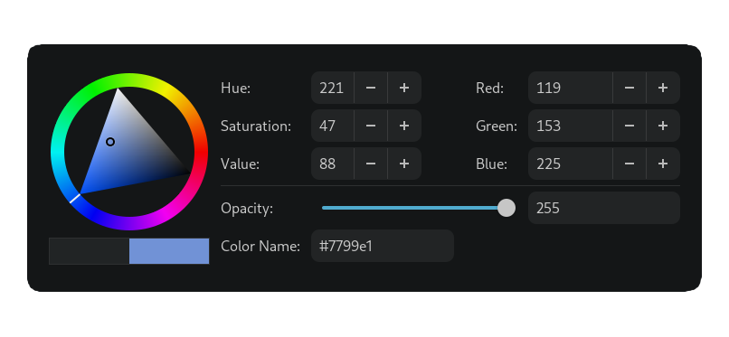

## Fork informations

This is a stripped down fork made to fullfill my need of a simple color manipulation tool.
I intend to use it along with [Hyprpicker](https://github.com/hyprwm/hyprpicker) as a bind shortcut.

**Example:**
```bash
gcolor3 --color "$(hyprpicker --autocopy)"
```

#### Changes from original
- Removed the eyedropper (To use something like Hyprpicker instead)
- Also removed the titlebar and color store feature.
- Added opacity to the hex (currently only works as output)
- Added a cli argument (--color) to change the default color
- Added a Nix flake

Translations is probably broken idk.

Color Picker
============

**Choose colors from the picker**



Compile from source
------------

### GNOME Builder (Recommended)

GNOME Builder is the environment used for the development of this
application. It can use Flatpak manifests to create a consistent building
and running environment cross-distro. Thus, it is highly recommended you
use it.

1. Download [GNOME Builder](https://flathub.org/apps/details/org.gnome.Builder).
2. In Builder, click the "Clone Repository" button at the bottom, using
`https://github.com/PierreBorine/gcolor3.git` as the URL.
3. Click the build button at the top once the project is loaded.

### Manual

If you feel at home in the terminal or would like to build outside of Builder,
these are the commands to use:

```bash
git clone https://github.com/PierreBorine/gcolor3.git
cd gcolor3
meson _build
ninja -C _build
```

License
-------

Please see [LICENSE](https://gitlab.gnome.org/World/gcolor3/blob/master/LICENSE) on [GitLab][gitlab].

**Copyright © 2013 - 2018** Jente Hidskes &lt;hjdskes@gmail.com&gt;

  [gitlab]: https://gitlab.gnome.org/World/gcolor3

